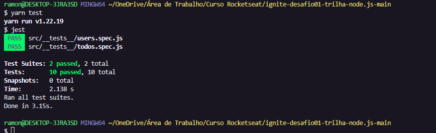

# ignite-desafio01-trilha-node.js
Desafio 01 - Conceitos do Node.js

<h1 align="center">
    
</h1>

Nesse desafio, foi criado uma aplicação para treinar o que foi aprendido até agora na trilha Node.js!

Essa e uma aplicação para gerenciar tarefas (em inglês *todos*). 
Será permitida a criação de um usuário com `name` e `username`, bem como fazer o CRUD de *todos*:

- Criar um novo *todo*;
- Listar todos os *todos*;
- Alterar o `title` e `deadline` de um *todo* existente;
- Marcar um *todo* como feito;
- Excluir um *todo*;

Testes de usuários

- **Should be able to create a new user**
- **Should not be able to create a new user when username already exists**
- **Should be able to list all user's todos**
- **Should be able to create a new todo**
- **Should be able to update a todo**
- **Should not be able to update a non existing todo**
- **Should be able to mark a todo as done**
- **Should not be able to mark a non existing todo as done**
- **Should be able to delete a todo**
- **Should not be able to delete a non existing todo**

https://www.notion.so/Desafio-01-Conceitos-do-Node-js-59ccb235aecd43a6a06bf09a24e7ede8
# ignite-desafio01-trilha-node
